# Why Study Energy Bills?

 

::: {.incremental}
- Household energy bills are **universal**, **salient**, and **recurrent**
- Energy prices have heterogenous effects 
- Energy prices are volatile
  - AI Data Centers
  - Extreme weather events
  - Geopolitical shocks 
:::
---

# Party competition to define the 'cause'

- Multiple narratives about why energy prices increased 
  - Mainstream parties: Russia
  - Populist radical right parties: Net Zero / climate policies

## Energy bills and Net Zero 

::: {.r-stack}
{.fragment .absolute top=30 right=80 width="450" height="300"}

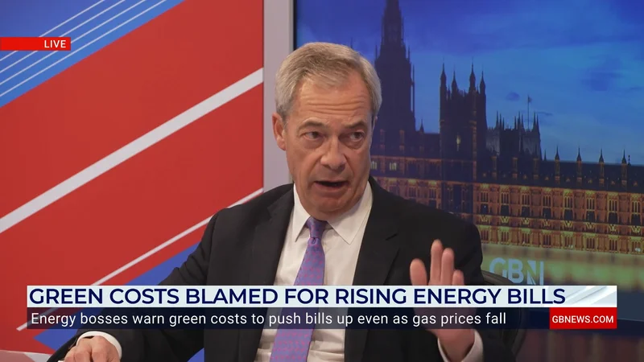{.fragment .absolute bottom=25 right=50 width="420" height="250"}

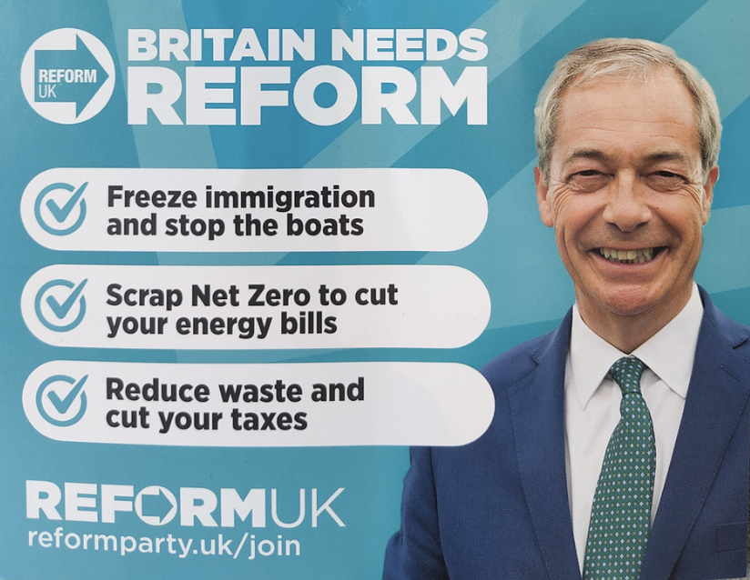{.fragment .absolute top=150 left=20 width="650" height="450"}
:::

# Existing Literature

# When Do Material Shocks Matter Politically?

> “...preexisting community conditions shape the political consequences of economic shocks” [@cremaschi2024without]

- Material shocks influence political preferences, but only under particular social and informational conditions [@healy2010random; @arceneaux2006held; @margalit2019political; @cremaschi2024without]
- Voters need **attribution of blame** to translate economic shocks into political change [@fiorina1981retrospective; @key1966responsible]

---

# PRR Parties as Crisis Entrepreneurs

 

::: {.incremental}
- PRR parties excel at **issue entrepreneurship** — seizing upon issues mainstream parties neglect [@vries2020political; @van2014exploiting]
- They **politicize crises** by providing clear **attribution of blame** [@mudde2017populism; @de2021crisis]
- Link economic grievances to issues they 'own' [@dickson2024going; @dickson2024public]
- Highlight **unfairness** and **unequal cost distribution**
:::

## Climate Policy: A Perfect Target for PRR Parties

 

::: {.incremental}
- Climate policy is **salient** but **complex** → vulnerable to politicization
- Mainstream parties often avoid contesting it → creates **political space** [@van2014exploiting]
- When costs are **visible** and **unequally distributed** → ripe for backlash [@stokes2016electoral; @colantone2024political]
- PRR parties can frame it as threat to economic well-being, security, sovereignty
- Evidence of backlash from:
  + Energy taxes [@voeten2024energy]
  + Car ban [@colantone2024political]
:::

# Core Theoretical Argument

1. **Material Shock:** Exogenous energy price spike  
2. **Blame Attribution:** PRR parties link bills → Net Zero 
3. **Heterogeneous Exposure:** Energy inefficiency → greater cost burden  
4. **Voter Response:** Affected individuals shift toward PRR parties, because:  
   - PRR parties provide clear attribution of blame  
   - PRR parties highlight unfairness of cost distribution
5. **Mechanism:** Shift in environmental attitudes (blame attribution), because:
    - Voters blame Net Zero for higher bills
    - Voters become more skeptical of climate policies

# Preview of Findings

::: {.incremental}
- PRR parties explicitly **linked energy bills to Net Zero** at moments of price spikes.
- Individuals in **energy-inefficient areas** became more likely to support PRR parties after price spikes.
- Effects **stronger among gas-dependent households**.
- Individuals more exposed shift their **environmental attitudes**.
:::

# The UK Context 

# The UK Context 

- High reliance on **gas heating** (~85% homes) 
- Old, poorly insulated housing stock (~37% built pre-1946)
- Structural inefficiencies → heterogeneous exposure to price shocks
- UK PRR parties with **anti-Net Zero** platforms:
  + UKIP (~2019-present)
  + Reform UK (post-Brexit party, 2019–present)

## UK Energy Bills

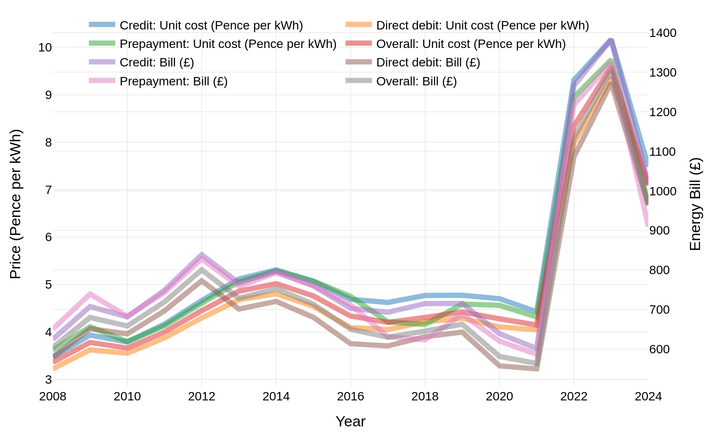{width=60%}

# Research Design 

- **Data:** 
  + Energy Performance Certificates (EPCs)
  + PRR Party communications (press releases, YouTube transcripts)
  + Support for PRR parties (Understanding Society, British Election Study)
- **Measurement:**
  + Energy price exposure via EPC scores
  + PRR rhetoric linking energy bills → Net Zero
  + Vote intention, attitudes 
- **Empirical Strategy:** Diff-in-Diff + Event Study + Triple Differences  
- **Identification:** Price shock $\times$ Pre-determined energy efficiency

# Data 

# Energy Performance Certificates (EPCs) 

 

- Issued to homes when built, sold, or rented
- Based on insulation, heating system, windows, etc.
- Rated A (most efficient) to G (least efficient)  
- 27 million records (>50% all UK homes)

## PRR Party Rhetoric: Linking Energy Bills to Net Zero

 

- UKIP Press Releases (2019-2024)
  + 402 press releases
  + Scraped from official website

- Reform UK & UKIP YouTube Video Transcripts (2019-2024)
  + 527 transcripts
  + YouTube API

> **Advantage:** PRR parties' organic communications to supporters

## Vote Intention and Attitudes Data

 

- **Understanding Society Panel**  
  - Waves 1–13 (2009–2023)  
  - ~30,000 individuals per wave  
  - Vote intention, demographics, attitudes
  - Energy Performance Certificate (EPC) linkage via LSOA 

- **British Election Study Internet Panel**  
  - Waves 1–29 (2014–2025)
  - ~30,000 individuals per wave
  - Attitude items on environment, economy, government performance
  - EPC linkage via MSOA (2-5k households)

# Measurement 

## Energy Exposure Measurement 

 

> **Goal:** Measure heterogeneous exposure to energy price shock (<2021)

- **Spatial Level:** Lower Layer Super Output Area (LSOA)  
  - ~400 households per LSOA
- **EPC Score:** Mean EPC rating of all homes in LSOA  
  - Converted to numeric scale: A=1, B=2, ..., G=7

$$EPC\ Score_{LSOA} = \frac{1}{N} \sum_{i=1}^{N} EPC\ Rating_i$$  
  

> **Higher score = lower energy efficiency**

## PRR Party Rhetoric: Linking Energy Bills to Net Zero

 

- **Window-Based Text Linking Method**  
  + Define three sets of keywords:  
    - **Set A:** Energy bill-related terms  
    - **Set B:** Net Zero-related terms
    - **Set C:** Connecting terms (e.g., "cut bills", "raising bills")
    - **Set D:** Causal linking terms (e.g., "because of", "due to")
  + For each document, create sliding windows of text (e.g., 50 words)
  + Count co-occurrences of Set A and Set B terms within each window
  + Calculate linkage score as the proportion of windows containing both sets of terms + causal linking terms (within a smaller sub-window, e.g., 12 words)

---

## PRR Party Rhetoric Measurement 

 

**Measurement 1** (A + B co-occurrence proportion)
$$
M_1 = \frac{|A \cap B|}{|U|}
$$

**Measurement 2** (A + B + C co-occurrence proportion)  
$$  
M_2 = \frac{|A \cap B \cap C|}{|U|}
$$

**Measurement 3** (A + B + D co-occurrence proportion)  
$$
M_3 = \frac{|A \cap B \cap D|}{|U|}
$$

# Support for PRR Parties

 

> **Goal:** Measure highly localized support for PRR parties over time

- **Dependent Variable:**  
  - Binary indicator for intention to vote for PRR party (UKIP or Reform UK)
- **Key Independent Variable:**  
  - Interaction of local EPC score and post-shock period dummy (Post-2021)

# Estimation Strategies

- **Difference-in-Differences (DiD)**  
  - Compare PRR support before/after shock across EPC levels
- **Event Study**  
  - Dynamic effects over time
- **Triple Differences**  
  - Interaction with gas dependence of households

> *All models use OLS, include individual and time fixed effects, with various controls for economic conditions*

## Baseline Difference-in-Differences (DiD) Model

 

> $$Y_{it} = α_i + γ_t + β (EPC_{LSOA} × Post_{2021}) + Controls_{it} + ε_{it}$$

- **$α_i$**: Individual fixed effects  
- **$γ_t$**: Time fixed effects  
- **$EPC_{LSOA}$**: Energy Performance Certificate score (LSOA level)  
- **$Post_t$**: Post-shock period indicator (Post-2021)
- **$Y_{it}$**: PRR vote intention for individual i at time t
- **$Controls_{it}$**: Time-varying controls (e.g., employment, Income, etc.)

# Identification Assumptions {#identification-assumptions}

> **Parallel Trends**

- Shock is global/exogenous
- Pre-determined EPC (pre-2021)
  + People do not sort into/out of areas based on EPC
- No income channel (<a href="#/no-income-channel">evidence</a>)
- Inefficiency → greater price increase exposure (<a href="#/manipulation-check">evidence</a>)

# Results 

## Spatial Variation in Energy Efficiency

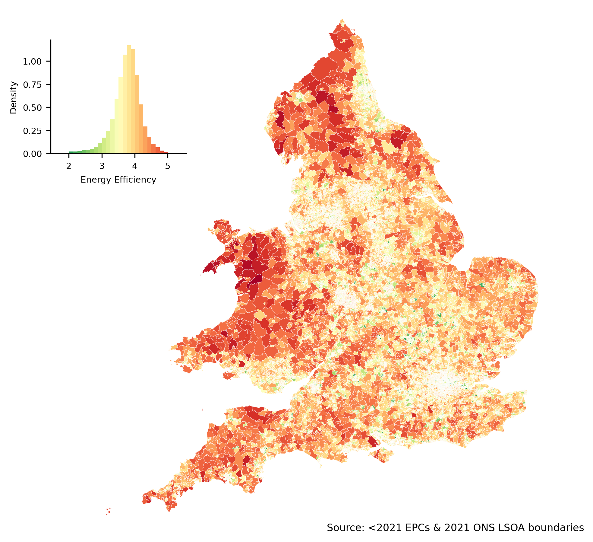{width=70%}

# Party Rhetoric

> **Example:** Net Zero, if met, will do nothing to deliver any meaningful benefit to the global environment but will destroy British jobs and lead to massive increases in energy bills year on year (Reform UK, 2023).

## Party Rhetoric Linking Energy Bills to Net Zero

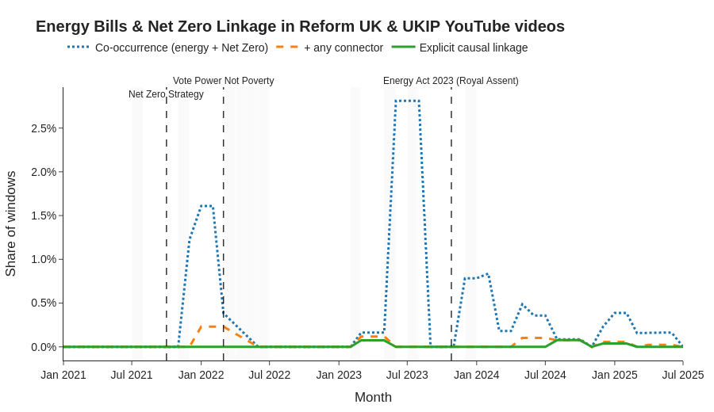{width=80%}

---

## PRR Rhetoric: Press Releases

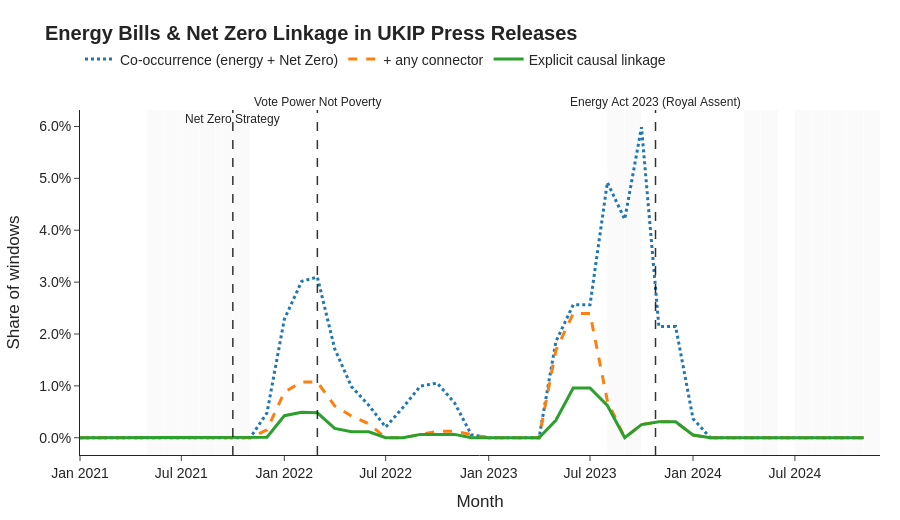{width=80%}

# Vote Intention Results {#vote-intention-results}

- <a href="#/DID-table">DID Results in Table Form</a>
- <a href="#/DDD-table">DDD Results in Table Form</a>

## Event Study Results

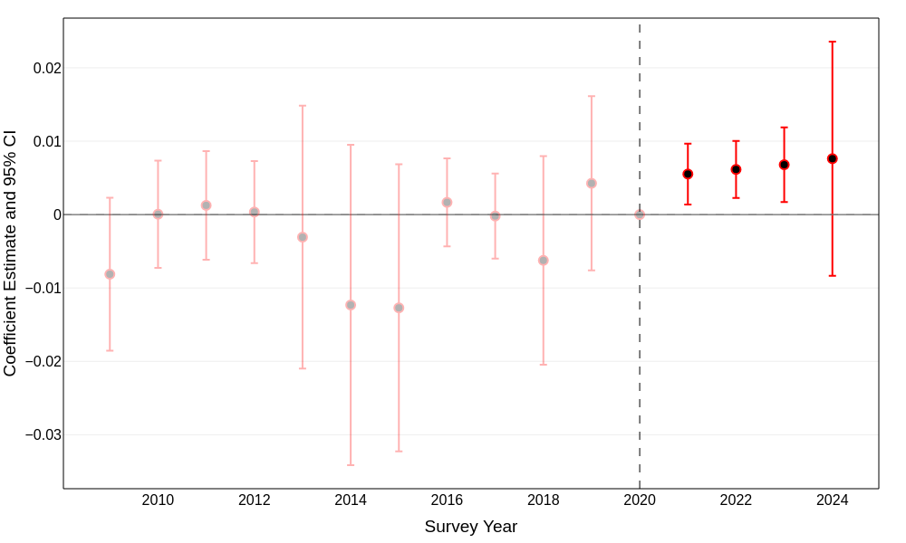{width=80%}

<a href="#/DID-table">DID Results in Table Form</a> 
<a href="#/DDD-table">DDD Results in Table Form</a>

# Mechanisms 

> Do voters who see their energy bills increase blame environmental policy?

- Potential mechanisms:
  1. Economic evaluations (e.g., income, financial status)
  2. Environmental attitudes (e.g., climate concern, skepticism)
  3. Environmental vs. economic trade-offs

## British Election Study Data

 

> Do you think that each of these has gone too far or not far enough?

- Measures to protect the environment (1-5 scale)
- Cuts to NHS spending (1-5 scale)
- Private companies running public services (1-5 scale)

> General Economic Evaluations

- Economy is Changing for the better (1-5 scale)
- General Economic Situation is Getting better (1-5 scale)

> Environment vs. Economy Trade-offs

- Environment vs. Economy (0-10 scale, 0=Environment, 10=Economy)

---

## Environmental Attitudes Shift

 

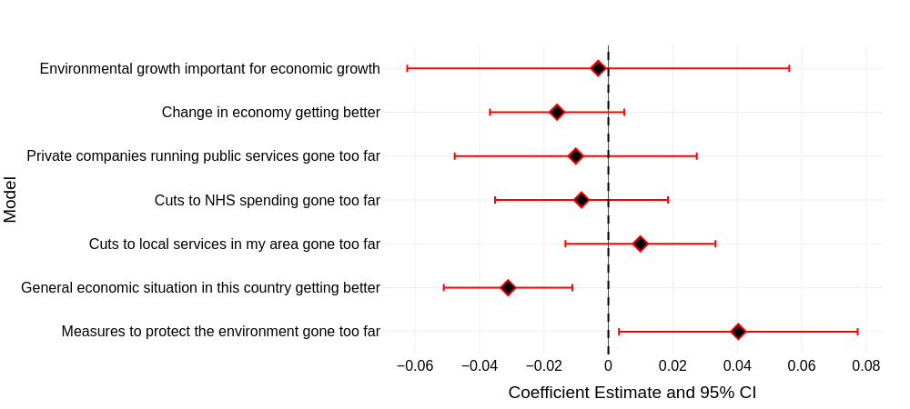{width=80%}

## Environmental Attitudes Shift

 

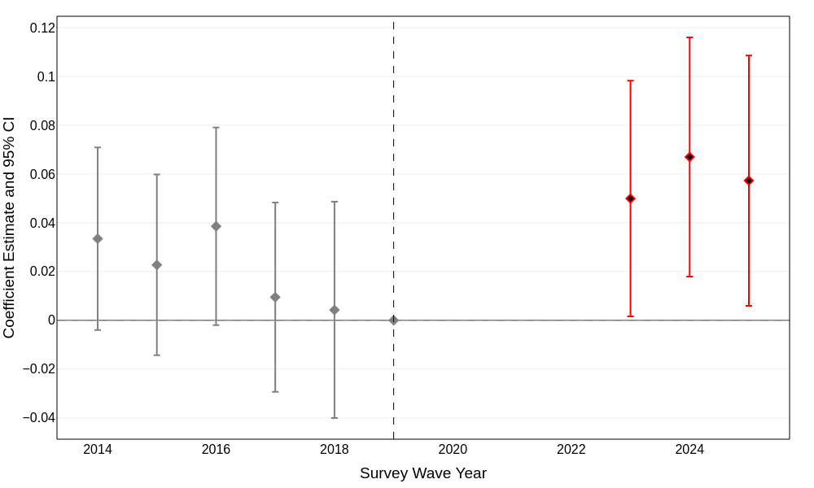{width=80%}

# Robustness Checks {#robustness-summary}

- Pre-trends absent
- Results robust to controls
- [Energy efficiency correlated with other grievances? No.](#placebo-tests)
  + Subjective financial status unaffected
  + Satisfaction with Income unaffected 
- [Effects on other parties?](#other_parties)
  - Nothing significant, indicating that higher costs are not driving a general anti-incumbent backlash, but rather attracting new PRR voters

> **Suggestions?**

# Discussion

> Unequal cost incidence + rhetorical framing → durable political consequences

::: {.incremental}
- PRR parties successfully linked energy bills → Net Zero
- Voters in energy-inefficient areas shifted toward PRR parties
- Effects amplified among gas-dependent households
- Environmental attitudes shifted; economic evaluations did not
:::

# Implications for Climate Policy

- Public support for climate policy sensitive to cost incidence
- When costs are salient and unevenly distributed, backlash likely
- PRR parties' rhetorical framing can amplify backlash
  + Similar patterns emerging in NL, IT, FR
  + Future energy-intensive shocks (e.g., AI datacenters) may reproduce dynamics

# Thank You!

- **Email:** [z.dickson@lse.ac.uk](mailto:z.dickson@lse.ac.uk)  
- **Website:** [https://z-dickson.github.io/](https://z-dickson.github.io/)  
- **Bluesky:** [zachdickson.bsky.social](https://bsky.app/profile/zachdickson.bsky.social)

[Back to Beginning](#/0)

  
Link to paper:

  

# References 

# Difference-in-Differences Design

$$
Outcome_it = α_i + γ_t +
              β (EPC_i × Post_t) +
              Controls_it + ε_it
$$

- $α_i$: Individual fixed effects  
- $γ_t$: Time fixed effects  
- $EPC_i$: Energy Performance Certificate score  
- $Post_t$: Post-shock period indicator

# Event Study Design

$$
Outcome_it = α_i + γ_t +
              Σ_k β_k (EPC_i × D_k) +
              Controls_it + ε_it
$$
- $D_k$: Time dummies for each period k

# Triple Differences Design

$$Outcome_it = α_i + γ_t +
 β (EPC_i × GasDep_i × Post_t) +
 Controls_it + ε_it
$$

## Manipulation Check - Energy Price Exposure {#manipulation-check}

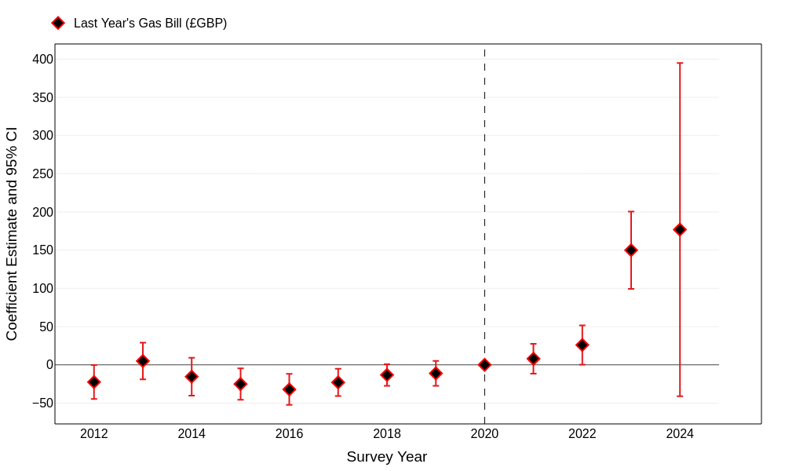{width=70%}

[Back to Identification Assumptions](#identification-assumptions)

---

## Manipulation Check - Energy Price Exposure {#manipulation-check}

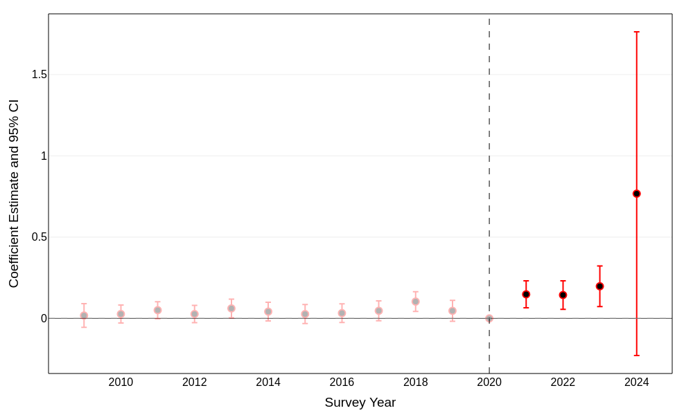{width=70%}

[Back to Identification Assumptions](#identification-assumptions)

---

## Effects of Energy Price Shock on Reported Income {#no-income-channel}

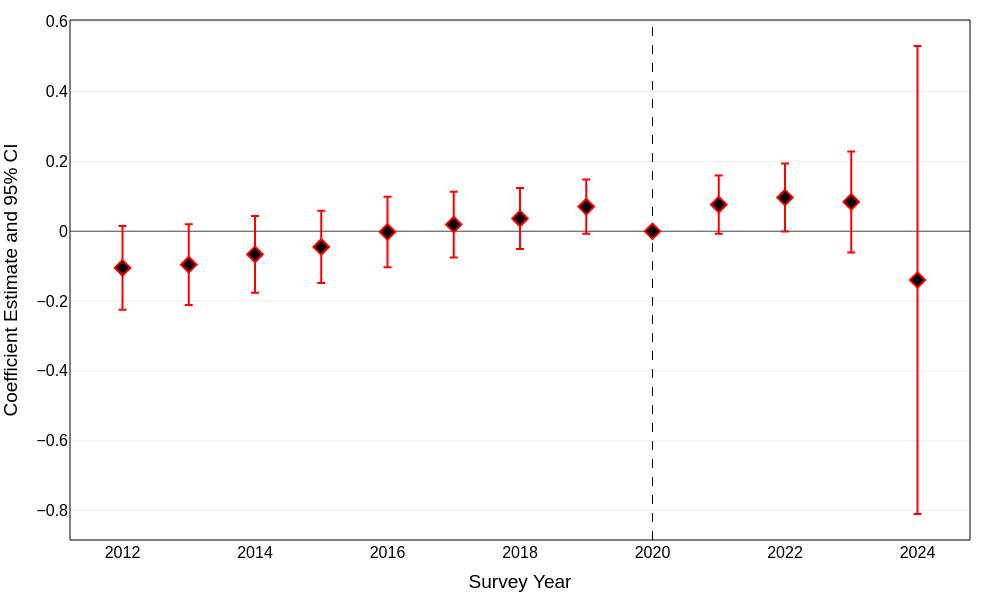{width=70%}

[Back to Identification Assumptions](#identification-assumptions)

---

## Vote Intention Results {#DID-table}

 

| Variable                                            | Model 1        | Model 2        | Model 3        |
|----------------------------------------------------|----------------|----------------|----------------|
| **Energy Vulnerability × Post-2021**               | **0.0077***    | **0.0083***    | **0.0081***    |
| &nbsp;&nbsp;(SE)                                   | (0.0021)       | (0.0021)       | (0.0023)       |
| Employment Rate                                    |               | ✓              | ✓              |
| Claimant Count                                     |               | ✓              | ✓              |
| Inactivity Rate                                    |               | ✓              | ✓              |
| Gross Disposable Income                            |               |               | ✓              |
| GDP per Person                                     |               |               | ✓              |
| Respondent FE                                      | Yes            | Yes            | Yes            |
| Year FE                                            | Yes            | Yes            | Yes            |

[Back to Vote Intention Results](#vote-intention-results)

---

## Triple Differences Results {#DDD-table}

 

| Variable                                                       | Model 1        | Model 2        | Model 3        |
|---------------------------------------------------------------|----------------|----------------|----------------|
| **Post-2021 × Energy Vulnerability × Gas Heating**            | **0.0116** **  | **0.0097** **  | **0.0091** **  |
| &nbsp;&nbsp;(SE)                                              | (0.0046)       | (0.0039)       | (0.0039)       |
| Employment Rate                                               |               | ✓              | ✓              |
| Claimant Count                                                |               | ✓              | ✓              |
| Inactivity Rate                                               |               | ✓              | ✓              |
| Gross Disposable Income                                       |               |               | ✓              |
| GDP per Person                                                |               |               | ✓              |
| Respondent FE                                                 | Yes            | Yes            | Yes            |
| Year FE                                                       | Yes            | Yes            | Yes            |

[Back to Vote Intention Results](#vote-intention-results)

---

## Placebo Tests {#placebo-tests}

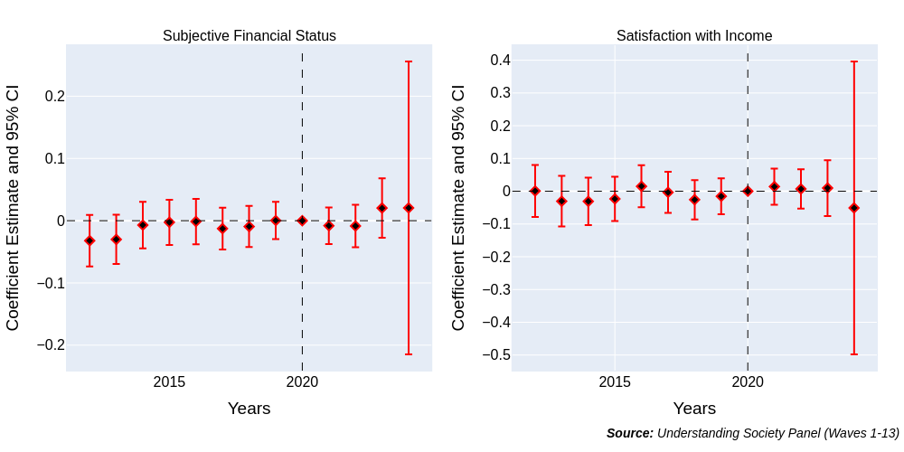{width=80%}

[Back to Robustness Summary](#robustness-summary)

---

## Effects on Other Parties {#other_parties}

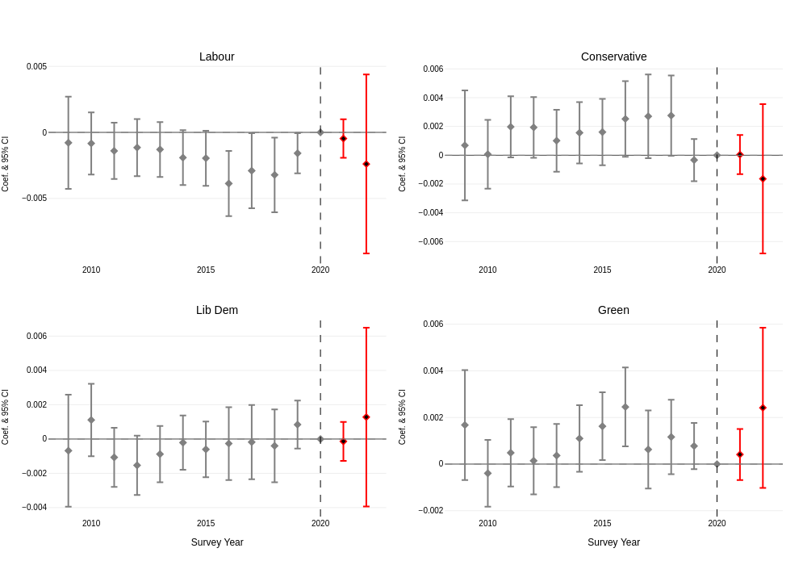{width=80%}