# Research Question {auto-animate=true}

- Two dominant explanations for populist right support:
  - **Economic backlash**: trade shocks, job losses, deindustrialisation [@margalit2019economic]
  - **Cultural backlash**: immigration, value change, status threat [@norris2019cultural]

- Less attention to citizens' *direct* experiences with the state through public services

- **This paper**: Does declining public service delivery fuel support for the populist right?
  - Do affected voters shift to the populist right — or to the mainstream opposition?
  - Is this conditioned by local immigration?

---

::: {.r-stack}
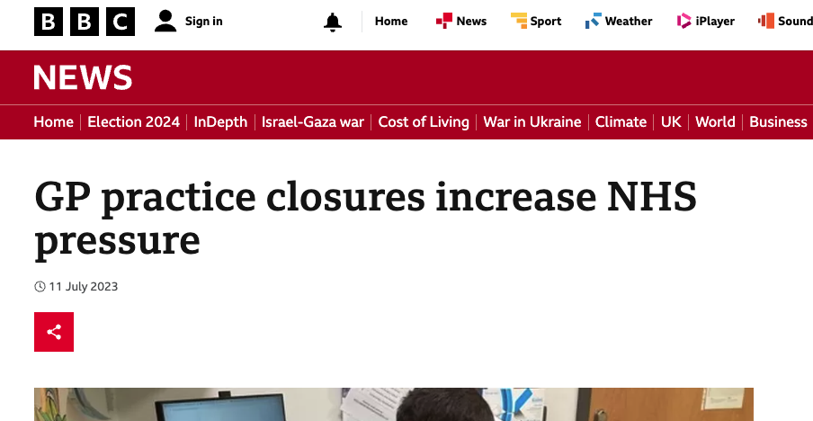{.absolute .fragment top="0" left="10" align="left" width="650" height="350"}

{.absolute .fragment top="10" right="20" align="left" width="650" height="300"}

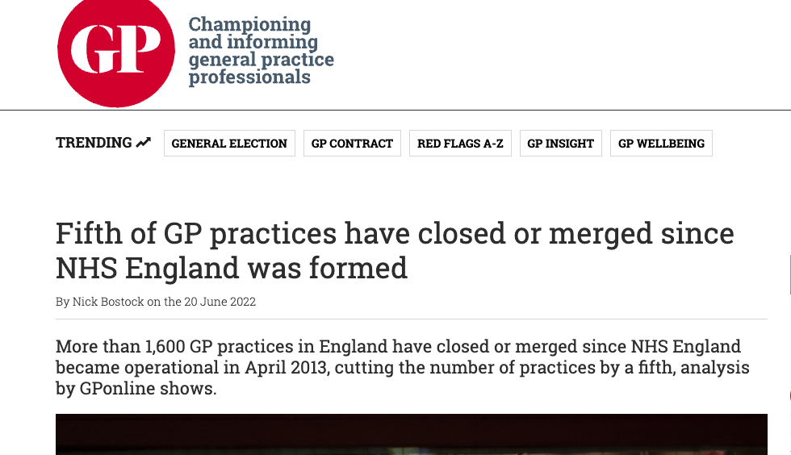{.absolute .fragment bottom="0" left="5" align="bottom" width="550" height="300"}

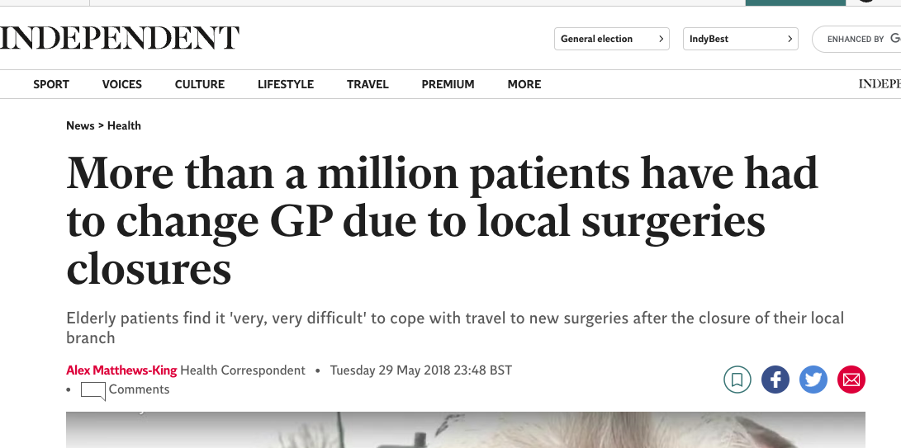{.absolute .fragment top="0" right="20" align="top" width="650" height="400"}

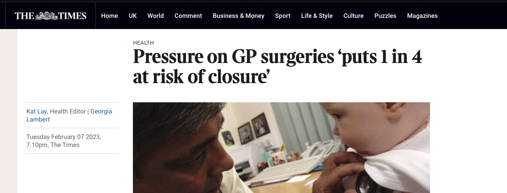{.absolute .fragment top="0" left="0" align="left" width="500" height="300"}

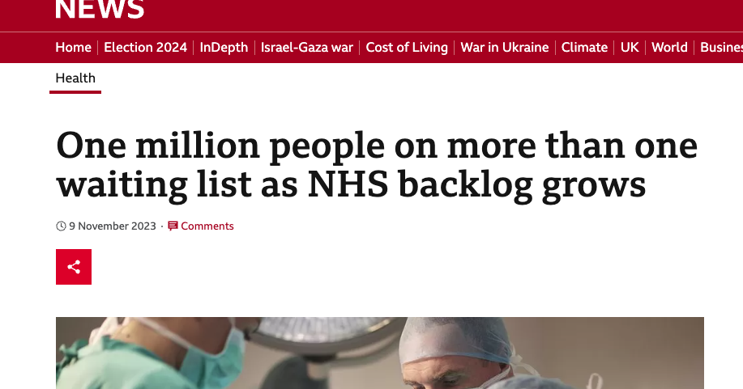{.absolute .fragment top="170" left="10" align="left" width="550" height="350"}

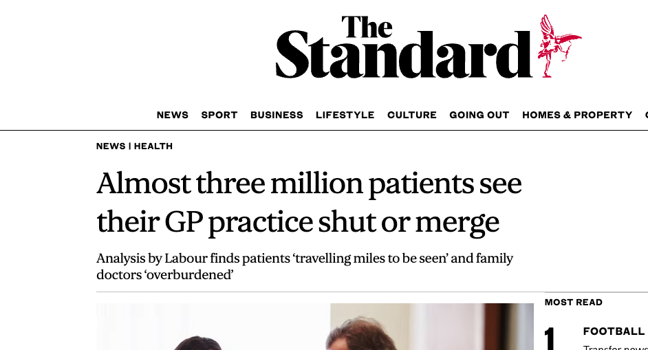{.absolute .fragment bottom="40" right="10" align="bottom" width="600" height="300"}
:::

# Theory {auto-animate=true}

- Public services are the most direct means through which citizens interact with and evaluate the state
- The **social contract**: citizens accept obligations (taxes, law) in exchange for core public services [@levi1988rule; @besley2020state]
- When the state fails to deliver, dissatisfaction and grievances follow
  - Validates the populist right's anti-establishment narrative [@mudde2016populist]

- **Why the populist right — not the left?**
  - Frames service decline through an ethno-nationalist lens: "deserving natives" vs. "undeserving migrants"
  - Attributes NHS strain directly to immigrant overuse
  - Framing is more credible to voters in areas where immigration is actually higher

# Expectations {auto-animate=true}

 

::: {.incremental}
1. Exposure to GP practice closures **increases support for the populist right**

2. The effects are **stronger in areas with greater immigration**, where the populist right's framing resonates more
:::

## The British Context {auto-animate=true}

- The **NHS** is a near-universal public service — virtually all citizens use it
  - Only ~12–14% of the population has private health insurance
  - A true *valence issue*: all parties back the NHS; voters demand more spending on it

- **NHS satisfaction** has declined to its lowest level in three decades

- GP practices are the **primary access point** to NHS care and specialized services

- The NHS has been a central issue in elections and the Brexit referendum

{.absolute .fragment bottom="50" right="150" width="500" height="300"}

## NHS: Public Opinion {auto-animate=true}

  

> **What sector should the UK government spend more on?**

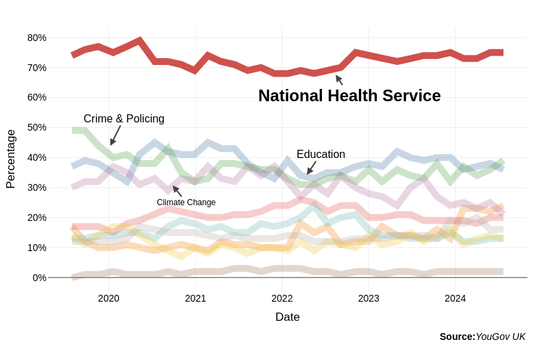

# GP Practice Closures {auto-animate=true}

- Since 2013: nearly **1,700 GP practice closures** in England — ~25% of all public practices
- Over **600,000 patients** directly affected
- Closures are driven by staff shortages, retirements — *not* conventional austerity
- Remaining practices absorb displaced patients → longer waits, worse care
- Provides staggered, exogenous spatial and temporal variation

## Patients Required to Register at a New Practice {auto-animate=true}

 

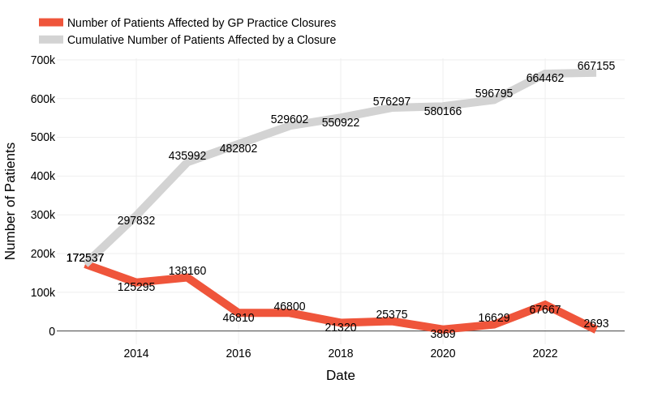

---

### From 2013-2024, 1,708 GP Practices Closed {auto-animate=true}

 

# Data {auto-animate=true}

:::: {.columns}
::: {.column width="50%"}
**Administrative & Survey Data**

- **NHS Digital**: universe of GP closures in England (2013–2023)
- **GP Patient Survey** (Ipsos): annual practice-level satisfaction for *every* GP practice in England
- **Understanding Society (USOC)**: ~30,000 households, 13 panel waves (2009–2022); restricted geo-linked version matched to GP catchment areas
- **British Election Study (BES)**: ~30,000 respondents, annual waves (2014–2023); geo-linked; used for independent replication

:::
::: {.column width="50%"}
**Contextual & Communication Data**

- **ONS Local Migration**: annual international migration and migrant GP registrations by local authority
- **English Indices of Multiple Deprivation** + local unemployment (ONS)
- **Party press releases**: 2,775 UKIP press releases (2010–2024)
- **Party YouTube channels**: 736 UKIP + 517 Reform UK videos (2011–2024); full transcripts analyzed

:::
::::

# Research Design {auto-animate=true}

:::: {.columns}
::: {.column width="50%"}
**Identification**

- **Staggered difference-in-differences**: exploits geographic and temporal variation in closures (first closure 2013, peak 2018)
- Treatment: residing in a Census area (MSOA) exposed to a GP practice closure
- Comparing areas with closures to *not-yet-treated* areas over time
- Parallel trends assessed via pre-treatment event study plots

:::
::: {.column width="50%"}
**Estimation Strategies**

- **Primary**: Sun & Abraham [-@sun2021estimating] cohort-average treatment effects — robust to heterogeneous treatment effects in staggered DiD
- **Robustness**: Matrix completion [@athey2021matrix; @liu2022practical] as alternative counterfactual estimator
- **Moderation**: Binning estimator [@hainmueller2019much] for conditional average treatment effects across levels of immigration, deprivation, unemployment

:::
::::

# Results

## Step 1: Do Closures Harm Patient Experiences? {auto-animate=true}

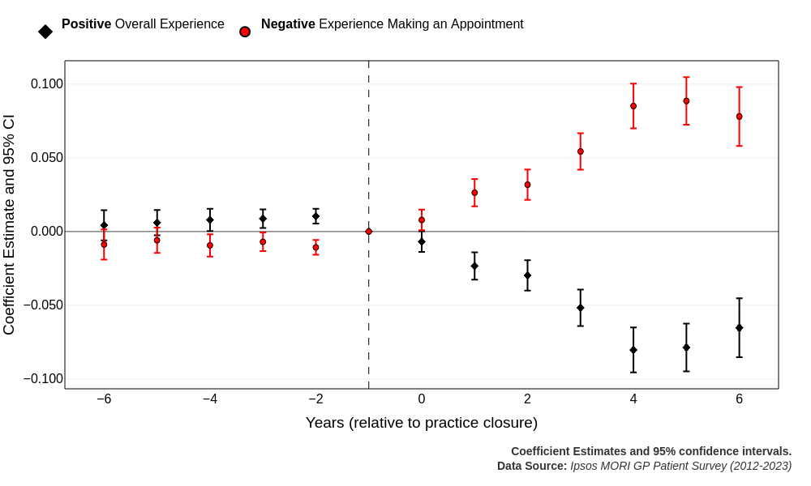

::: aside
**Note:** Dynamic effects of a nearby closure on patient satisfaction at area GP practices. Black: % reporting positive overall experience (↓). Red: % reporting negative appointment experience (↑). Effects emerge immediately and persist 4–5 years.
:::

## Step 2: Do Voters Shift to the Populist Right? (USOC) {auto-animate=true}

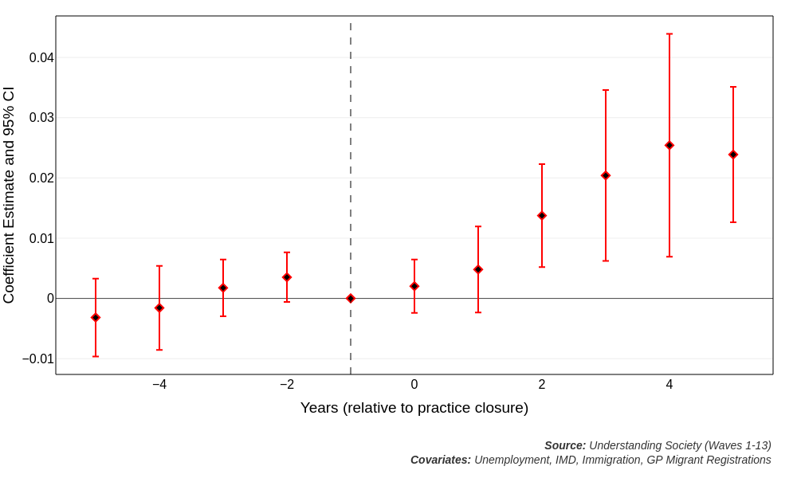

::: aside
**Note:** Sun-Abraham event study, USOC panel (~30,000 households, 2009–2022). Respondent, area, and year fixed effects. Controls: unemployment, IMD deprivation, immigration, migrant GP registrations. Effects peak at ~2.5pp after 3–4 years.
:::

## Step 2: Do Voters Shift to the Populist Right? (BES) {auto-animate=true}

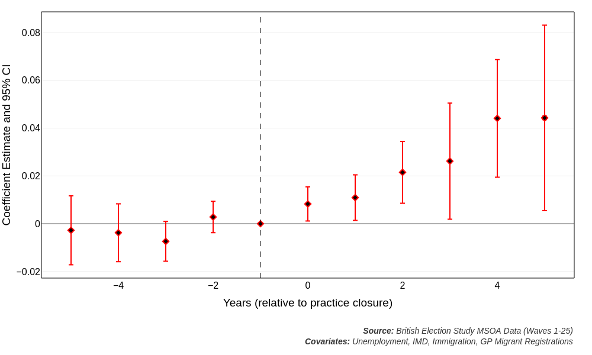

::: aside
**Note:** Independent replication using the BES panel (~30,000 respondents, 2014–2023). Results consistent in direction and timing. Effects peak at ~4pp approximately 4 years post-closure — slightly larger than USOC estimates.
:::

## Step 3: How? Populist Right Links NHS Decline to Immigration {auto-animate=true}

 

> Two Empirical Measures of Linkage in Populist Right Communication

 

:::: {.columns}
::: {.column width="50%"}
**Type 1: Co-occurrence only**

::: {style="font-size: 0.9em; font-style: italic; border-left: 3px solid #ccc; padding-left: 10px;"}
"And I again I think that Britain is broken. Maybe the prime minister doesn't realize this, but the vast majority of us realize the [**NHS**]{style='color: #c0392b;'} is not working as it was intended and needs radical reform. Of course, one of the problems is that 7.2 million [**foreign born**]{style='color: #c0392b;'} people have signed up with [**GPs**]{style='color: #c0392b;'} in the last 10 years alone. Can you believe that? 7.2 million people extra. So don't be surprised if there's a big cue to get, you know, an appointment with your local GP."
:::

::: {style="font-size: 0.65em; color: #555; margin-top: 8px;"}
Immigration and NHS co-occur; no explicit causal connector — not classified as direct causal linkage.
:::
:::
::: {.column width="50%"}
**Type 2: Co-occurrence + causal connector**

::: {style="font-size: 0.9em; font-style: italic; border-left: 3px solid #ccc; padding-left: 10px;"}
"We've got 10,000 people a week coming into Britain, half a million coming in every year, nearly 5 million economic [**migrants**]{style='color: #c0392b;'} in the space of the last 10 years. It is totally unprecedented, it has never happened before [and] the effects are obvious in every single part of our national life with massive [**strain on**]{style='color: #c0392b;'} the [**NHS**]{style='color: #c0392b;'}."
:::

::: {style="font-size: 0.65em; color: #555; margin-top: 8px;"}
UKIP (2013): "strain on" is an explicit causal connector in close proximity — classified as direct causal linkage.
:::
:::
::::

::: aside
**Note:** Farage (Type 1) vs. UKIP 2013 video (Type 2). Both are captured as co-occurrences; only Type 2 is additionally classified as containing an explicit causal link.
:::

## Step 3: Populist Right Links NHS Decline to Immigration {auto-animate=true}

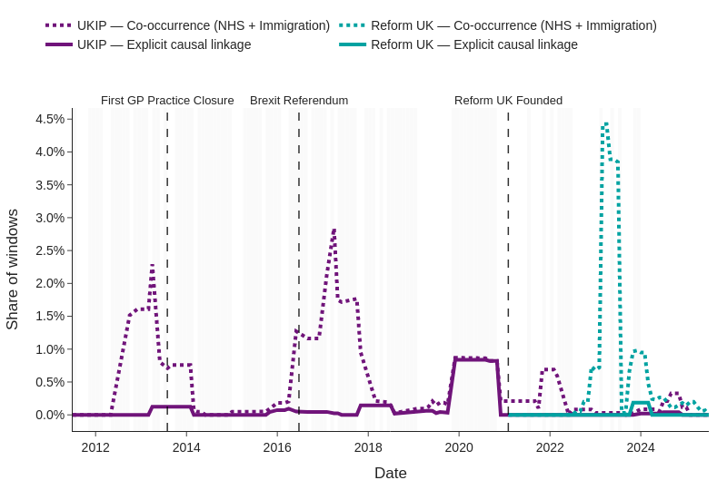

::: aside
**Note:** Share of UKIP/Reform UK YouTube video windows that co-mention NHS and immigration (with explicit causal connectors). Analysis covers 1,253 videos + 2,775 press releases. Both parties consistently frame NHS decline as caused by immigration.
:::

## Step 3: Immigration Moderates the Effect {auto-animate=true}

 

:::: {.columns}
::: {.column width="50%"}
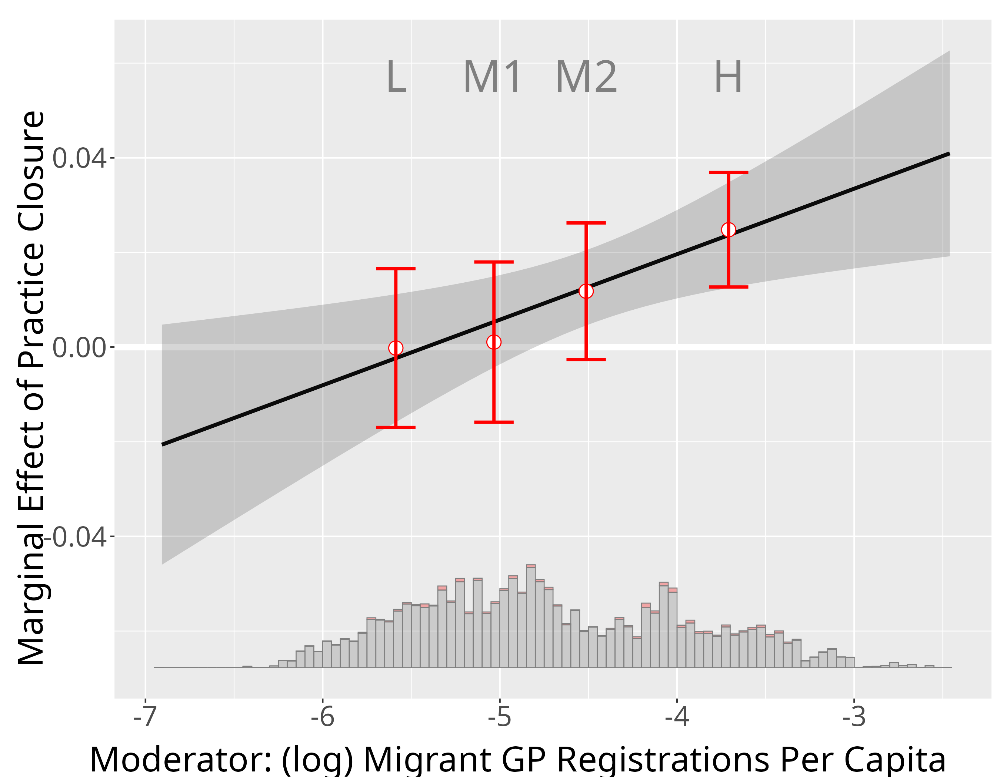
:::
::: {.column width="50%"}
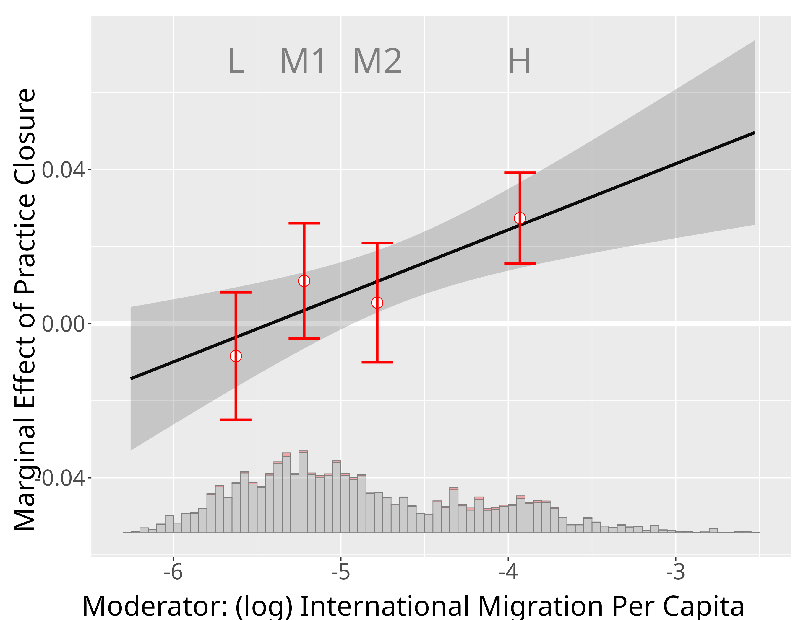
:::
::::

::: aside
**Note:** Conditional average treatment effects (binning estimator, @hainmueller2019much). Effects of closures on populist right vote are significantly larger in high-migration areas (both migrant GP registrations and general immigration). Distributions of treated (red) and control (gray) areas are well-balanced.
:::

# Robustness Checks {auto-animate=true}

:::: {.columns}
::: {.column width="50%"}
**Alternative Estimation**

- **Matrix completion** (Athey et al. 2021): results consistent in magnitude and significance across both patient satisfaction and vote intention outcomes
- **Four model specifications** (no controls → full controls): all consistently significant

**Sample Restrictions**

- **Not-yet-treated only** as control group: results robust (N=66,467; noisier due to smaller sample)
- **Re-opening practices**: including as treated or as control — results unchanged

:::
::: {.column width="50%"}
**Placebo & Falsification Tests**

- **Placebo outcomes**: no detectable effects of closures on financial situation, future financial expectations, income satisfaction, or job satisfaction
- **No residential sorting**: closures do not increase preferences or plans to relocate — ruling out Tiebout-style exit
- **Vote intention vs. actual vote**: strong correspondence with realized vote shares in 2015, 2017 and 2019 elections

**Moderation specificity**

- Immigration moderates effects **only for the populist right** — null or negative interaction for all other party families
:::
::::

# Conclusions {auto-animate=true}

- **Causal evidence** that GP practice closures increase populist right vote intention by **2–4 percentage points**, effects persisting for at least 4–5 years

- Effects are **specific to the populist right** — no comparable gain for Labour or other opposition parties

- **Immigration amplifies the effect**: stronger in areas with higher migrant inflows and migrant GP registrations — consistent with populist right messaging

- **Key Contribution**: Public service decline is a distinct, underappreciated driver of populist right support
  - Beyond economic and cultural backlash: *state performance matters*
  - Particularly consequential where the populist right can credibly link service decline to demographic change
  - Policy implication: maintaining public service quality is a first line of defence against populist mobilisation

# References

# Appendix {visibility="uncounted"}

## A1: Four Model Specifications — BES {visibility="uncounted"}

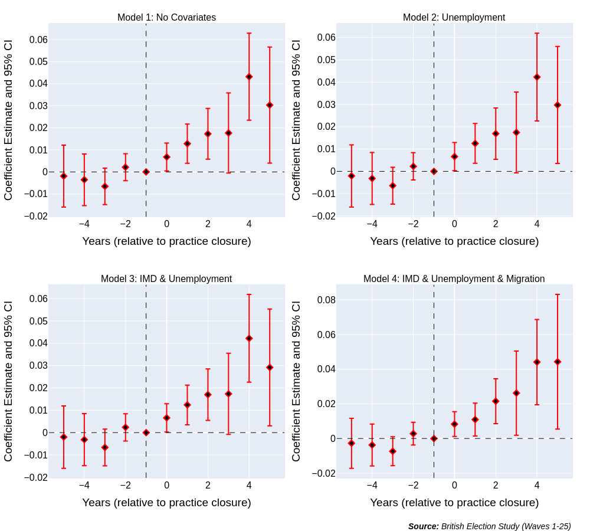

::: aside
**Note:** Models 1–4 progressively add respondent FE, area FE, year FE, and control variables (unemployment, IMD, immigration, migrant GP registrations). Results are consistent across all specifications.
:::

## A2: Four Model Specifications — USOC {visibility="uncounted"}

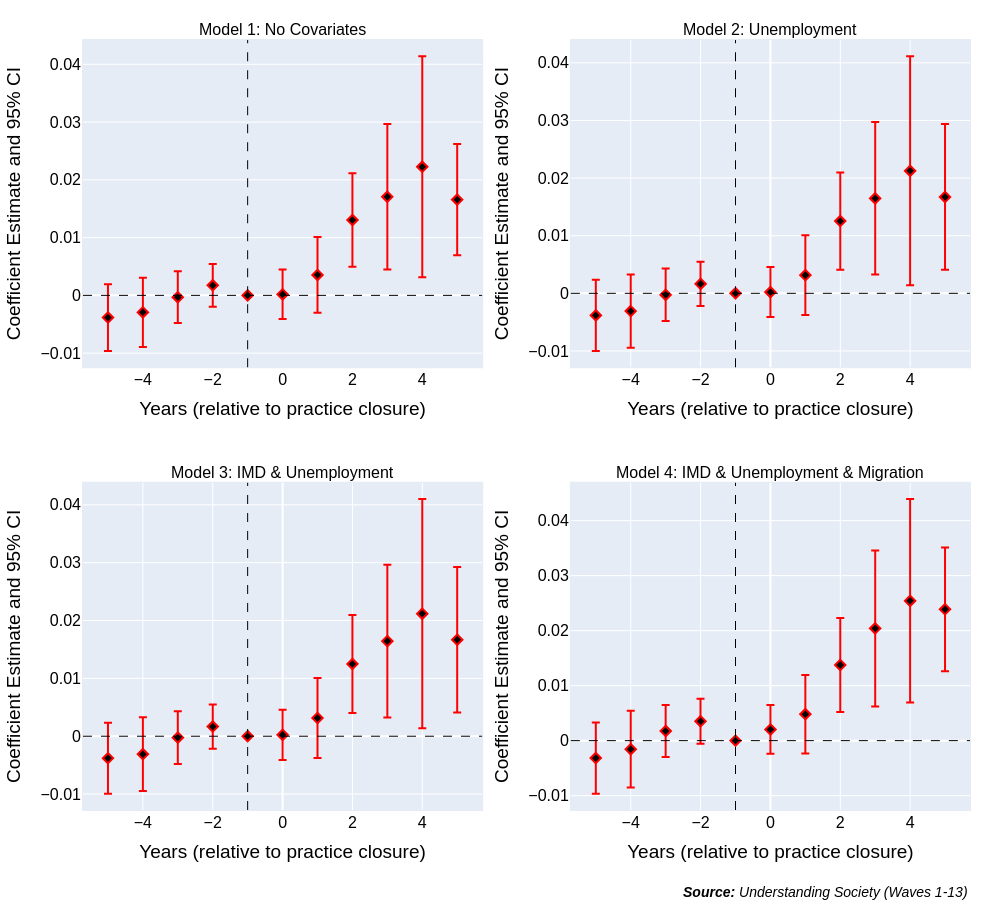

::: aside
**Note:** As above but using the USOC panel. All four model specifications yield consistent positive effects of closures on populist right vote intention.
:::

## A3: Effects on All Party Families {visibility="uncounted"}

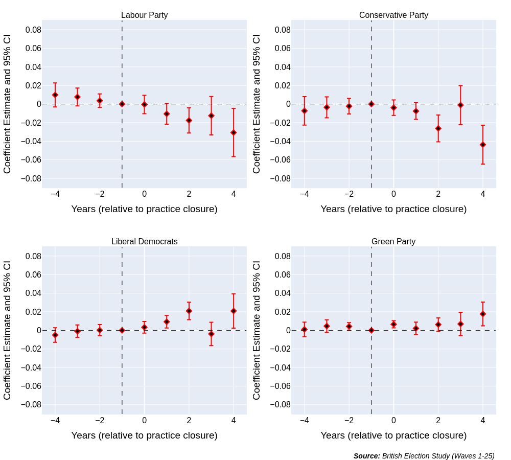

::: aside
**Note:** GP closures reduce support for mainstream parties (Labour, Conservative) but the largest and most consistently estimated effect is for the populist right. No offsetting gain for Labour.
:::

## A4: Not-Yet-Treated as Control Group {visibility="uncounted"}

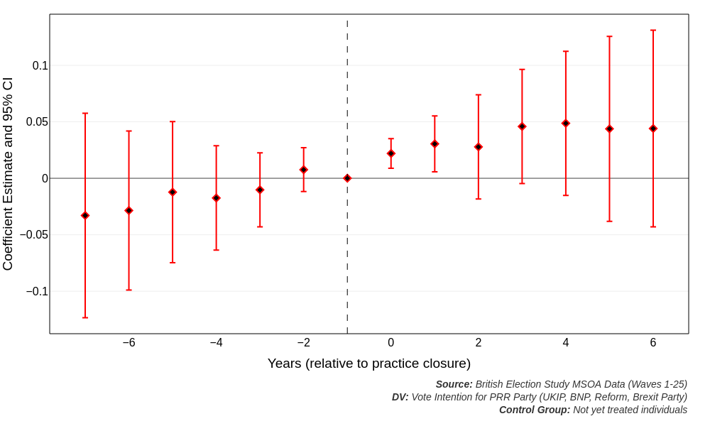

::: aside
**Note:** Re-estimation restricting the control group to individuals who will eventually be treated but have not yet experienced a closure. Results are robust (N=66,467). Addresses concerns about systematic differences between ever-treated and never-treated areas.
:::

## A5: Placebo Outcome Tests {visibility="uncounted"}

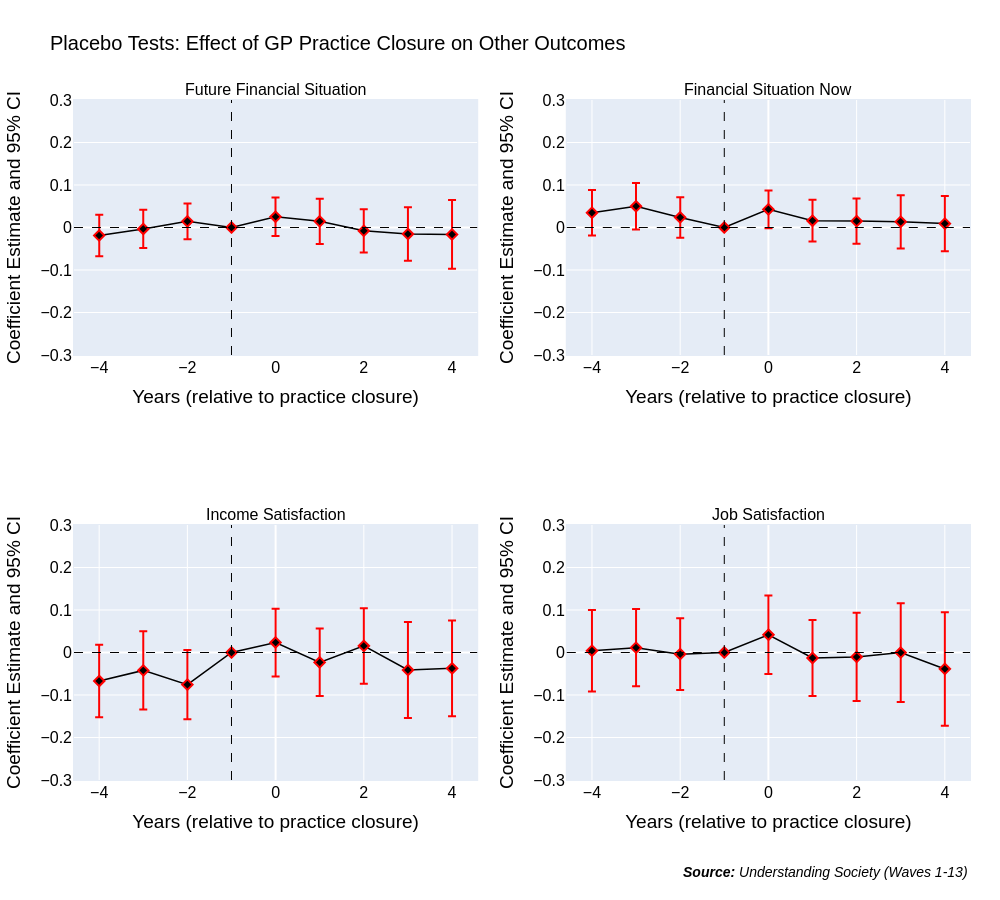

::: aside
**Note:** Placebo tests replacing the populist right vote outcome with financial situation, future financial expectations, income satisfaction, and job satisfaction. No statistically detectable effects, supporting the specificity of the main results.
:::

## A6: No Residential Sorting {visibility="uncounted"}

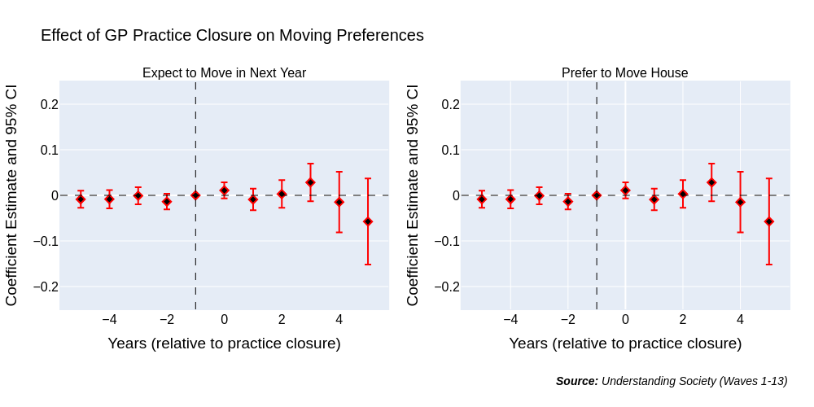

::: aside
**Note:** Effects of GP closures on preferences and expectations to move house. No detectable effects, ruling out Tiebout-style exit responses that could confound the main estimates.
:::

## A7: Vote Intention vs. Actual Vote Share {visibility="uncounted"}

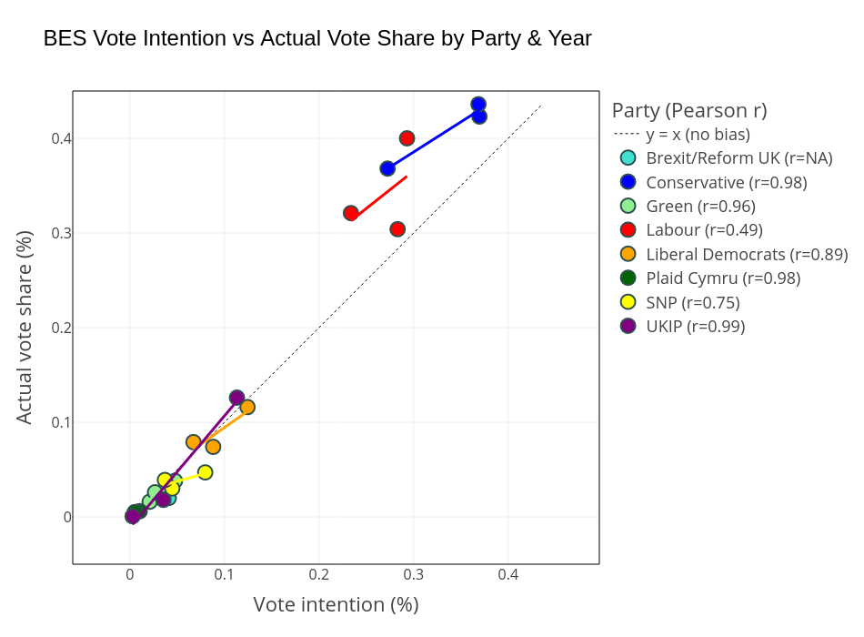

::: aside
**Note:** Correspondence between BES vote intention and realized vote shares in the 2015, 2017 and 2019 General Elections. High correlation validates the use of vote intention as a proxy for electoral behaviour.
:::

## A8: Press Release Linkage — NHS and Immigration {visibility="uncounted"}

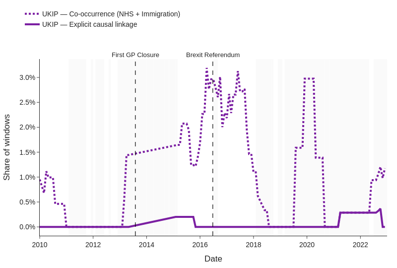

::: aside
**Note:** Share of UKIP press releases (2010–2024) co-mentioning NHS and immigration (with and without explicit causal connectors). Complements the YouTube analysis: UKIP consistently links NHS decline to immigration across both channels.
:::

## A9: Patient Satisfaction — Matrix Completion Replication {visibility="uncounted"}

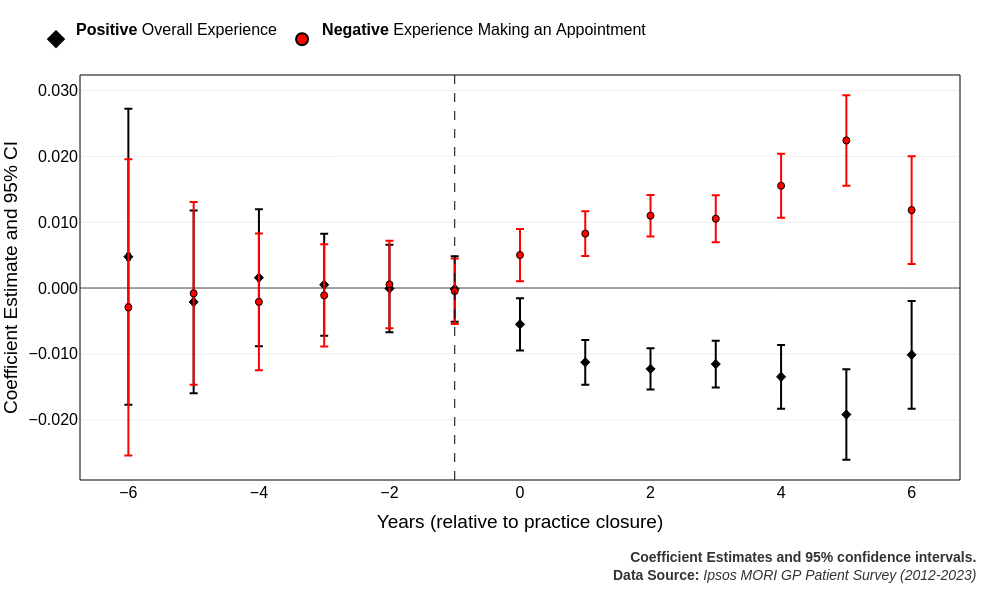

::: aside
**Note:** Matrix completion replication of the patient satisfaction results. Estimates are consistent with the primary Sun-Abraham event study, providing additional confidence in the manipulation check.
:::

## A10: Populist Right Vote — Matrix Completion Replication (USOC) {visibility="uncounted"}

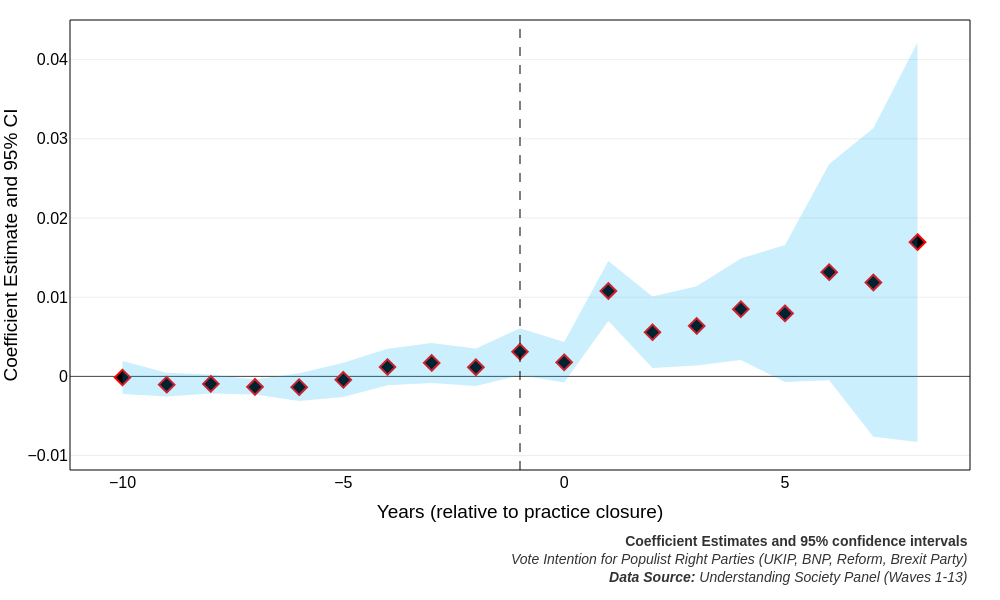

::: aside
**Note:** Matrix completion replication of the USOC vote intention results. Estimates are consistent in magnitude and direction with the primary Sun-Abraham event study specification.
:::
