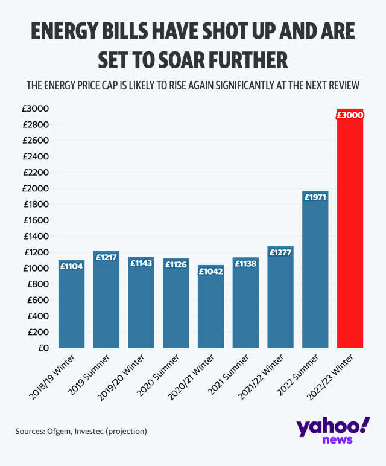
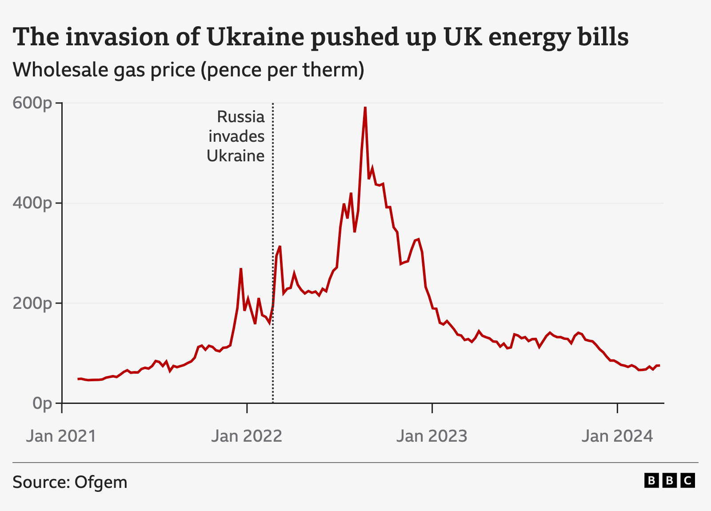
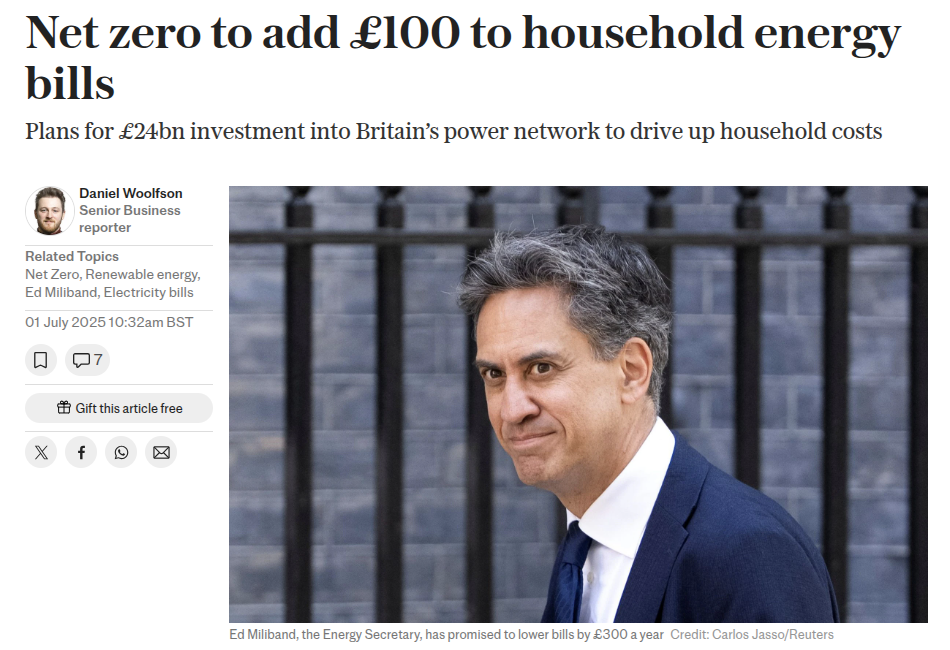
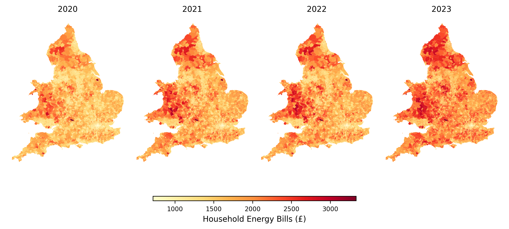
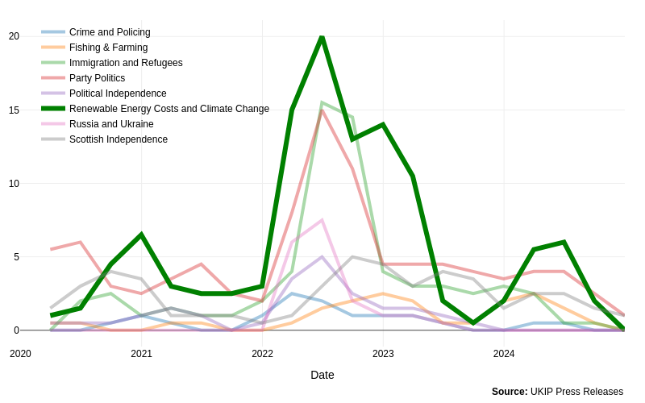
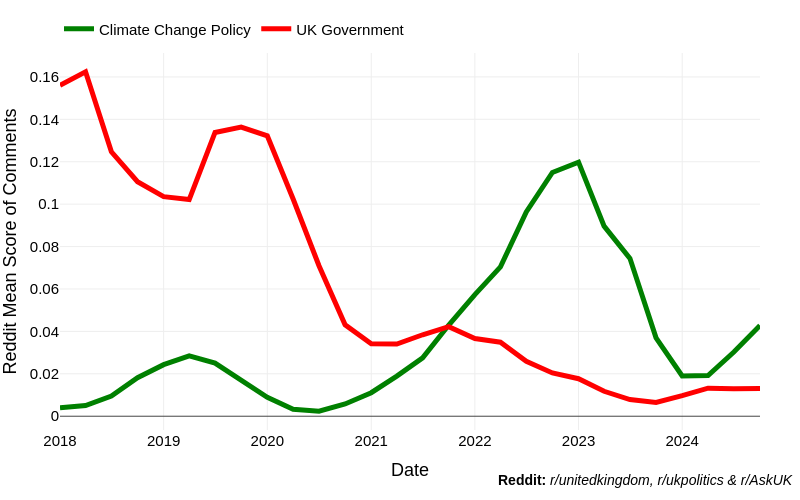
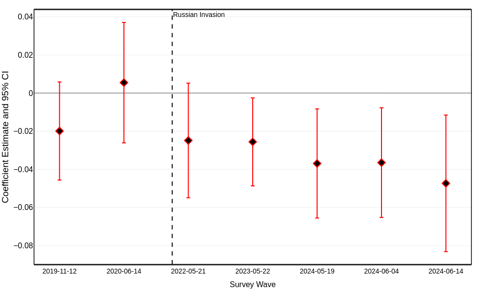
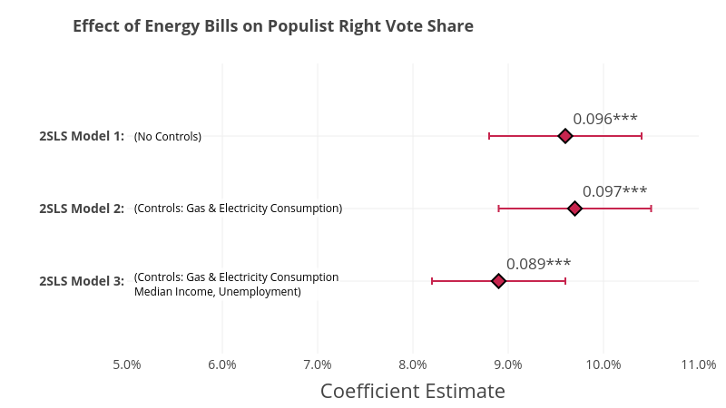

## Motivation

::: {.r-stack}

{.absolute .fragment bottom="50" right="50" align="left" width="550" height="650"}

{.absolute .fragment top="50" left="50" align="left" width="750" height="500"}

{.absolute .fragment bottom="50" right="200" align="left" width="650" height="450"}

{.absolute .fragment bottom="150" right="50" align="left" width="650" height="450"}

:::

# Motivation

> The transition to renewable energy is essential but often faces public resistance that can undermine the climate agenda 

::: {.incremental}

- Climate change policies often have **unequal impacts** on segments of the electorate, potentially leading to backlash 
- **Populist right parties** emerging as the primary beneficiaries of this backlash, with significant electoral gains in recent years [@Bosetti2025]
    - Populist right parties have been successful in capitalizing on the distributional consequences of climate policies, often framing them as elite-driven agendas that harm ordinary people [@dickson2024going]
        - 'Brown' jobs in fossil fuel industries are threatened by climate policies  [@bolet2024get;@heddesheimer2024energy; @cavallotti2025green]
        - Lower-income households face higher costs from climate taxes [@voeten2024energy;@colantone2024political] 

:::

## Green Backlash & the Populist Right

::: {.incremental}

- So far, research has focused on **specific climate policies** (e.g., carbon taxes) and their electoral consequences 
    - In line with retrospective voting theory, these studies show that voters punish governments for specific climate policies that raise costs 
- But what about **broader economic shocks** that impact household energy costs, like the 2022 energy crisis?
    - Populist right parties have actively framed the energy crisis as a failure of climate policy, blaming "Net Zero" for rising costs 

 

- **Research Question**: Can populist right parties leverage broader economic shocks, like rising energy bills, to undermine support for climate policies and gain electoral advantage?
    - Do rising energy bills lead to a shift in public attitudes against environmental protection?
    - Do these shifts translate into electoral gains for populist right parties?

:::

## Research Design & Data

::: {.incremental}

- **Estimating Household Energy Bills**

    + 27 million Energy Performance Certificates (EPCs)
    + Multiple regression with post-stratification using 2021 Census data on housing characteristics (XGBoost)
    + Accurate to within 8% of actual bills, with a mean absolute error of ~£90/year

- **Climate Attitudes**

    + British Election Study (BES) panel data (2019-2024 - 7 waves)
    + Question asks respondents to prioritize the economy (0) vs. the environment (10)

- **Voting Behavior**

    + New panel dataset of nearly 15,000 local elections at the ward level

- **Right-wing populist party press releases**
    + Dynamic Topic modeling on press releases 2020--2025

- **Reddit Comments on Energy Bills**
    + 60 million comments to understand linking of energy bills to climate policy

:::

---

## Energy Bills in the UK

{.absolute top="100" left="50" align="left" width="950" height="450"}

# Empirical Strategies

## Climate Attitudes 

 

> **Goal**: Estimate the dynamic relationship between rising energy bills as a proportion of income and changes in support for environmental protection 

$$ \text{Support}_{it} = \alpha + \sum_{t} \beta_t \left( \text{EnergyBills}_{jt} \times \text{SurveyWave}_t \right) + X_{jt} + \mu_i + \lambda_t + \varepsilon_{it} $$

- **Support**: Respondent's support for prioritizing the environment over the economy (0-10 scale)
- **Energy Bills**: Estimated annual household energy bills for the neighborhood where the respondent lives, as proportion of their household income
- **Survey Wave**: Indicator for the wave of the British Election Study (BES) survey (2019-2024 - 7 waves)

---

## Voting Behavior

> **Goal**: Estimate the causal effect of rising energy bills on vote share for populist right parties in local elections

- **Shift-share instrumental variable (IV)** design to isolate the causal effect of energy bills on voting behavior 
    - **The "Shift" (Exogenous Shock)**: Daily Russian military equipment losses in Ukraine, capturing the intensity of the war that drove global energy prices but is unrelated to UK voting behavior
    - **The "Share" (Local Exposure)**: Proportion of households in each ward connected to the main gas grid, based on 2021 Census data (before the price shock)
    - **The Logic**: This strategy isolates the part of the energy bill increase caused specifically by the war's impact on gas prices, allowing for a clean estimate of its electoral consequences

---

## Finding 1: UKIP Links Energy Crisis to Climate Policy

{.absolute top="100" left="100" align="left" width="850" height="500"}

## Finding 2: The Public Links Energy Bills to Climate Policy

{.absolute top="100" left="100" align="left" width="850" height="500"}

## Finding 3: Attitudes Shift Against the Environment

{.absolute top="100" left="100" align="left" width="850" height="600"}

## Finding 4: Electoral Gains for the Populist Right

{.absolute top="100" left="60" align="left" width="850" height="500"}

## Conclusion & Implications

::: {.incremental}

- Summing up the findings & Robustness Checks

- **Green backlash is not just about specific government taxes**. Broader economic shocks, even if external, can be weaponized to undermine the climate agenda

- **The backlash is real and has two forms**: It erodes public support for environmental protection *and* shifts votes to anti-climate parties

- **Framing is critical**. Populist right parties successfully blamed "Net Zero" for a crisis largely caused by a war, highlighting a major vulnerability for governments pursuing green transitions

:::

---